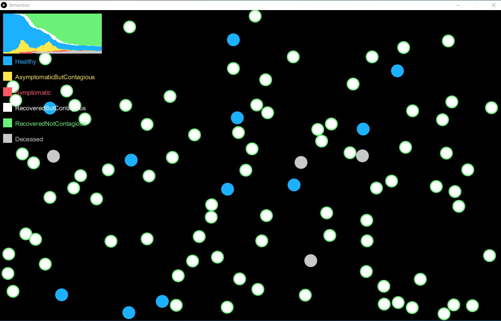
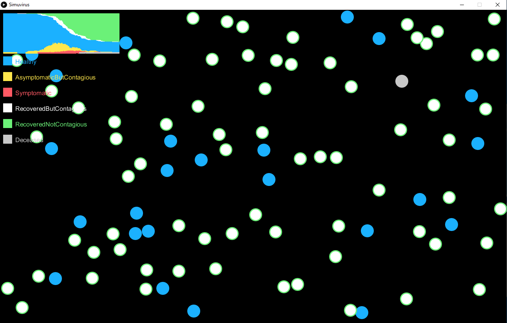
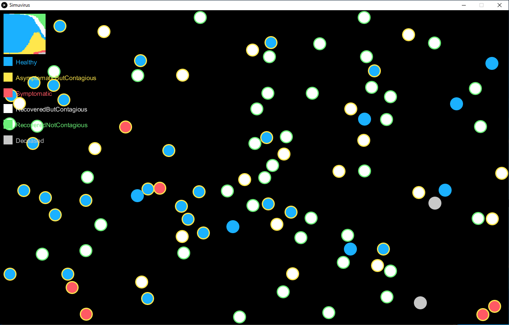

# Simuvirus
All models are wrong, but some are more useful than others. This is both wrong and not useful. Makes pretty pictures though.

Inspired by: https://www.washingtonpost.com/graphics/2020/world/corona-simulator/?fbclid=IwAR1HFdJQIfihLQsmcK9qUfyAgCUYohd-lQz_myEqaMmZ6Co9815sBi-AepA

Scripted using: https://processing.org/

With intermittent social distancing, there's a periodic effect in the number of contagious individuals. In theory this would continue until heard immunity is reached and the virus dies off.
In this run, social distancing was recommended when 30% of population was contagious, and relaxed when the contagious population fell down to 10%.

Observed rise and fall in contagious cases is expected with social distancing:
https://www.technologyreview.com/s/615370/coronavirus-pandemic-social-distancing-18-months/?te=1&nl=coronavirus-briefing&emc=edit_cb_20200317&campaign_id=154&instance_id=16859&segment_id=22332&user_id=1474e0217a8ff9d63031e7d096686458&regi_id=90791928

Herd immunity:
https://www.technologyreview.com/s/615375/what-is-herd-immunity-and-can-it-stop-the-coronavirus/

Population of 100, no social distancing

Halfway: 
