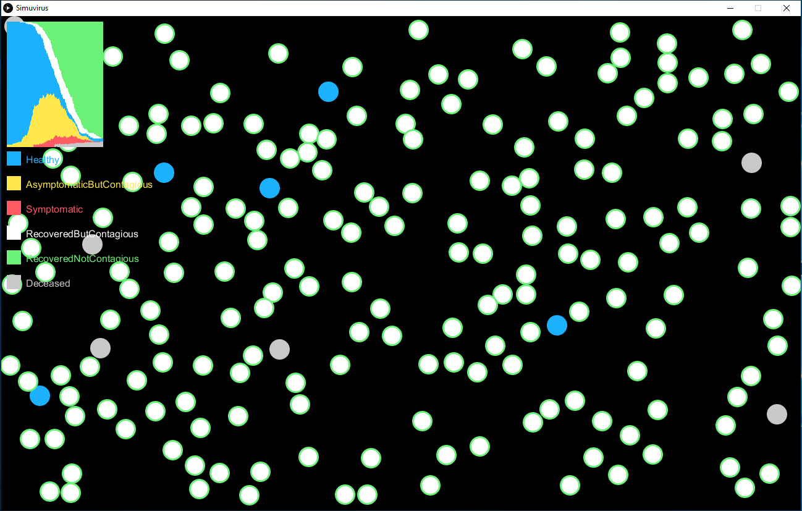
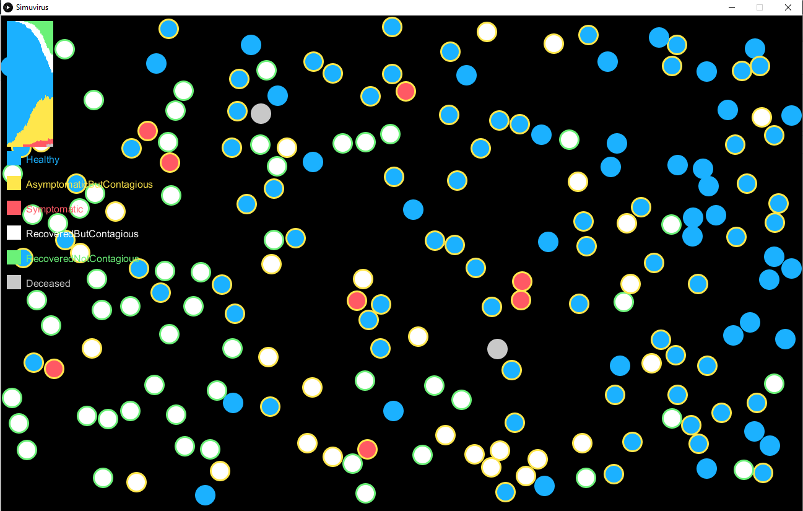

# Simuvirus
All models are wrong, but some are more useful than others. This is both wrong and not useful. Makes pretty pictures though.

Inspired by this: https://www.washingtonpost.com/graphics/2020/world/corona-simulator/?fbclid=IwAR1HFdJQIfihLQsmcK9qUfyAgCUYohd-lQz_myEqaMmZ6Co9815sBi-AepA

Scripted up using: https://processing.org/

